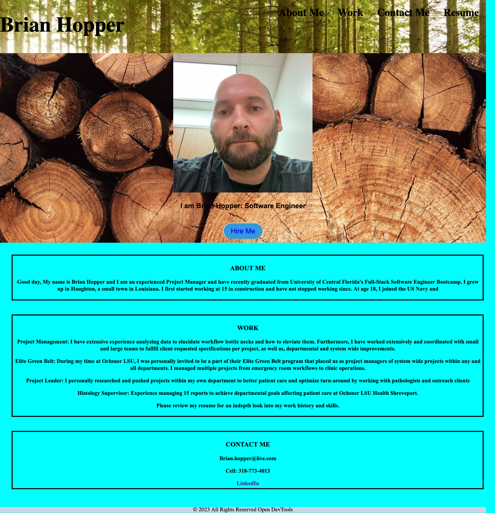

# Portfolio
## MOTIVATION
AS A job seeker
I WANT employer's to view my deployed portfolio of work samples
SO THAT they can review my work and assess whether I am good candidate for their open position.

## REASON FOR PROJECT
AS A software engineer
I WANT potential employer's to see my knowledge and skills at work with additional background about myself.

## PROBLEM-AND-SOLUTION
THE PROBLEM is that employer's have no easy access to know if I am a good candidate for their open position.
THE SOLUTION is a portfolio that provides all information an employer needs to make a sound descision to hire me for their open position.

## DESCRIPTION
THIS SITE is a chronological description of my experiences, skills, and projects. This site includes links to my professional resume and projects with the added scheme that elucidates for hiring employers my thinking processes when building applications.

## PORTFOLIO ACCESS
Live Site:
https://brian12345-webdev.github.io/Portfolio/
GitHub Repo:
https://github.com/Brian12345-webdev/Portfolio

